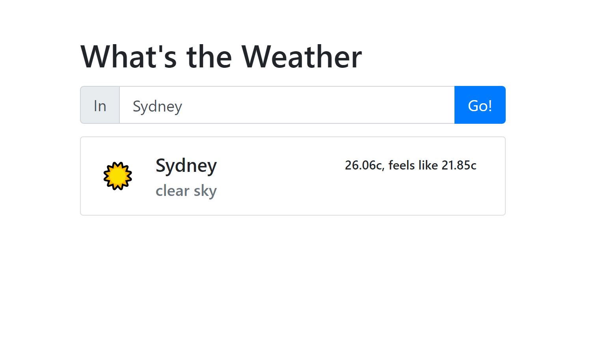

# Weather App: Trying out async Javascript

## Description



Create an app that uses [openweather.org](https://openweathermap.org/guide) to grab the current weather in a location of your choice.

> #### Tools
>
> - [HTML5](https://developer.mozilla.org/en-US/docs/Web/Guide/HTML/HTML5)
> - [Async Functions](https://developer.mozilla.org/en-US/docs/Web/JavaScript/Reference/Statements/async_function)

## Walkthrough

### Step 1: Get the API

1. Head over to [openweather.org](https://openweathermap.org/guide) and sign up to use their free API. (Or use the one provided by us)
2. Find the [API key](https://home.openweathermap.org/api_keys) page and generate a key to use. Paste it as a variable in your code as we will need it later.
3. Read through the [documentation](https://openweathermap.org/current) about using the current weather data, and practice an API call in either Postman or your browser.

```javascript
api.openweathermap.org/data/2.5/weather?q={city name}&APPID={API key}&units=metric
```

Replace the `={city name}` and `={API key}` with the city you want and your API key.

> Remove the curly brackets

### Step 2: Create the HTML and CSS

1. Create a page using a text input, a submit button, and a space for the data to be displayed.
2. Create a template card that will be used to display the data

#### Test Your Code!

Now is a good chance to test your page, open your `index.html` on your favourite browser or run `open index.html` from your terminal inside the weather-app folder. You may need to _hardcode_ some expected data from the API.

### Step 3: Implement the Javascript structure

1. Target all the required elements using `document.querySelector()`
2. Add an eventListener with the argument of `click` to the submit button
3. Assign a variable that stores the value of the input field once the button has been clicked
   > Make use of `console.log()` in these steps!
4. Outside of the event listener, create a new function `const createCardHtml = (text) =>` It will take in the parameters of the API data, but for now just pass the user submitted input as an argument.
5. In `createCardHtml` return the template card that was created in the html. Pass in the input value as one of the parts of your card to make sure it works!
   > You will need to return the string using template literals and the `return` keyword if you have not used the one line function style.
6. In the event listener call the function passing in the input value. `const cardHtml = createCardHtml(cityInput.value);`
7. As the last line of the event listener, render the template card. `weatherContainer.innerHTML = cardHtml;`

### Step 4: Use the API's response

Read through the [using Fetch](https://developer.mozilla.org/en-US/docs/Web/API/Fetch_API/Using_Fetch) guide on mdn, or the [async await](https://developer.mozilla.org/en-US/docs/Learn/JavaScript/Asynchronous/Async_await) if you would prefer the newer methods.

1. Create a new function that fetches the weather info from the API. Use either fetch or async await.
2. Using template literals for the API url, insert the query parameters you have

```javascript
fetch(
  `https://api.openweathermap.org/data/2.5/weather?q=${city}&APPID=${appId}&units=metric`
);
```

3. Format the response into a usable format with `.then(response => response.json());`
4. `console.log()` the `json` formatted response and make a note of what data you want to use. For example, the temperature is under `data.main.temp` It is important to find the correct data as not all API's will respond with the same format.
5. Call the function in the event listener, passing in the input from the text field.
6. Instead of using `console.log()` for the data, pass the required information into the `createCardHtml` function that was made earlier.
7. You may need to change the arguments for this function, and it should now look something like this: `const cardHtml = createCardHtml(name, emoji, temp, feelsLike, description);`
8. Fill in the template literals in the `createCardHtml` function so that the card is populated with the data from the API.

### Step 5: Optional extras

1. Implement error handling with the API response
2. Try using a geoLocation button that checks for the user's current location.

## Example

Stuck? Check out the provided example in the [example/html](example/html) folder!

---

# The Weather App... In React 🚀

### Installation

I use [vite](https://vitejs.dev/guide/) to create a quick boilerplate for react. There are several options available that you can find in the [react docs](https://react.dev/learn/start-a-new-react-project)

1. `npm create vite@latest weather-app`
2. select `React`
3. select `Javascript + SWC`
4. `cd weather-app`
5. npm install
6. npm run dev

### Step 1: The setup

1. Create the file and folder structure you need for the project, removing any unwanted files.
2. Find your openweather app key and add it to the variable in [App.jsx](src/App.jsx)
3. Refactor your html into jsx.

### Step 2: The card template

1. Create a component for a template card.
2. For now _hardcoded_ data is fine, but shortly it will be using props.
3. import proptypes using `import PropTypes from "prop-types";` This will allow the props to be type checked. (Ideally we would use an actual typed language but that's for another day)
4. Take the previous cardHtml and paste it in the render section, changing any necessary jsx syntax

### Step 3: The weather app

1. Import the Card and useState.
2. Create a setState hook for the input's value, and one for the weather data.
3. Target the input's value and and use the hook to set the state on change.
4. Create a `handleSubmit` function that is called on submit of the form. This function will call the API and use the result to set the `weather` state with the `setWeather` hook. Try a `console.log` to make sure it works.
5. Render the `Card` component if there is data in the `weather` state.
6. Pass the weather state as a prop into the `Card` component.

There is an opportunity to learn even more technologies, such as [typescript](https://create-react-app.dev/docs/adding-typescript/). Or more advanced react techniques such as [react redux](https://react-redux.js.org/).
